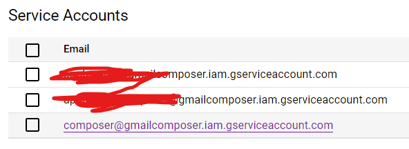
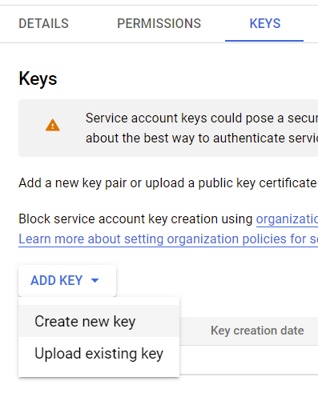

<!-- PROJECT LOGO -->
<br />
<p align="center">
    

  <h3 align="center">Gmail Composer</h3>

  <p align="center">
    <a href="https://github.com/amiradmehr/mail-composer/issues">Report issues or  Request features</a>
  </p>
</p>


<!-- TABLE OF CONTENTS -->
<details open="open">
  <summary>Table of Contents</summary>
  <ol>
    <li><a href="#about-the-repo">About The Repo</a>
    <li>
      <a href="#getting-started">Getting Started</a>
      <ul>
      <li><a href="#prerequisites">Prerequisites</a></li>
        <li><a href="#installation">Installation</a></li>
      </ul>
    </li>
    <li><a href="#how-to-use-it">Usage</a></li>
</details>


<!-- ABOUT THE PROJECT -->
## About The Repo


Suppose you are lazy or don't have enough time to send emails to professors worldwide and apply for a university. In that case, mail-composer is the way to go.
All you need to do is prepare a list of professors and their emails and one or two templates or as many as you desire and leave the rest of the tedious tasks to the bot.


<!-- GETTING STARTED -->
## Getting Started


### Prerequisites

1. First up go to your [google account security setting](https://myaccount.google.com/security) and create a **app password** and save it somewhere
This is an example of how to list things you need to use the software and how to install them.

2. Next you need to enable google drive and google sheet api. go to [google cloud platfrom](https://console.cloud.google.com/) and **create a project**. Then in the search bar search for **google drive api** and **google sheet api** and enable them.

3. In your project go to [credentials section](https://console.cloud.google.com/apis/credentials) and create a service account.
   
   ![Create Credential][create-credential-pic]
   * give it a name
   * set the role as **Editor**
   * Done
4. click on the **serive account** that you just create and click on **KEY** section at the top of the page and create a JSON key. Then copy the `json` file in the directory and rename it to `credentials.json`.

  <p align="center">
    
    
  </p>


### Installation

1. Clone the repo
   ```sh
   git clone https://github.com/amiradmehr/mail-composer.git
   ```
2. Install required packages
   ```sh
   pip install -r requirements.txt
   ```
3. Create a `.env` file in the directory then copy and assign these variables
   
   
  ```sh
    EMAIL = youremail
    PASSWORD = your bot passwors
    CREDENTIALS = credentials.json
    SHEET_NAME = your google sheet name
    WORKBOOK_NAME = the workbook name
    CV = the cv file name
  ```
  for example
  ```JS
    EMAIL = jason@gmail.com
    PASSWORD = ajsbd654adsas45
    CREDENTIALS = credentials.json
    SHEET_NAME = apply2021
    WORKBOOK_NAME = UNITEDSTATES
    CV = CV.pdf
  ```

<!-- USAGE EXAMPLES -->
## How To Use It
